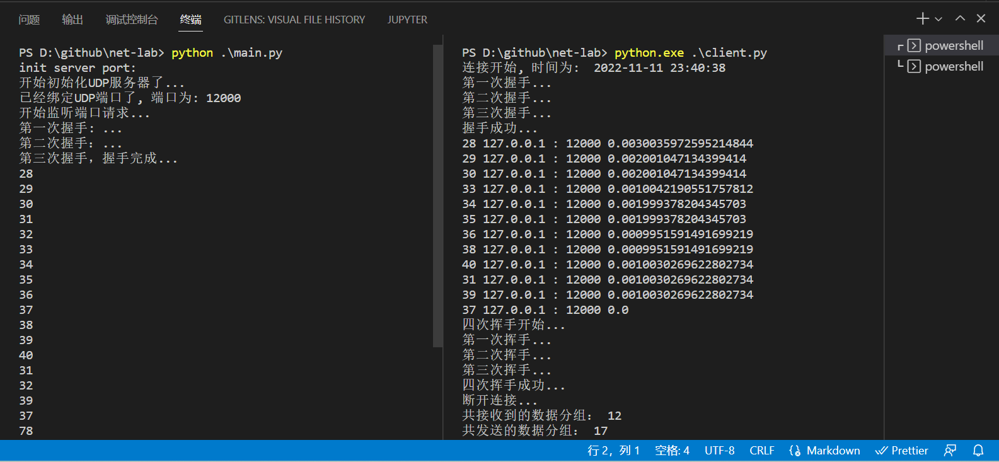
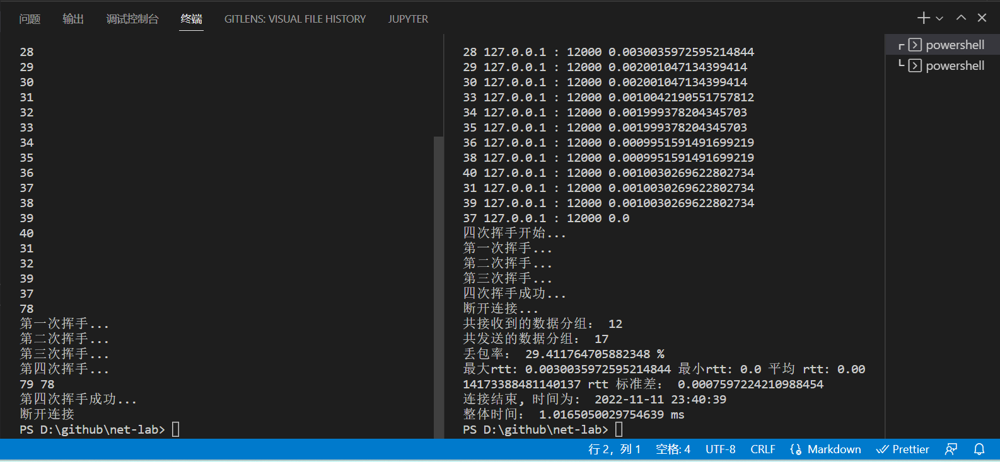

# net-lab

## 环境

### 代码运行环境

```bash
python --version
> 3.11.0
```

### 程序编写平台

windows 11

### 代码版本管理

git: <https://github.com/creampnx-x/net-lab>

## 流程

### 服务端

1. 使用python创建一个udp socket，绑定固定的接口。
2. 等待客户建立连接, 提供三次握手，首先 syn = 1, 1, 0并判断seq等数据标志符号顺序后，成功建立连接。
3. 等待传输数据，对于每一个请求判断随机概率是否大于0.8来模拟丢包。
4. 若某请求 fin=1，则进入结束请求流程。
5. 四次挥手 fin，ack，fin，ack。

#### 优化

1. udp 监听端口上所有请求，判断请求ip和端口来分发给不同的处理线程，以达到连接状态效果。若对于一个没有记录的请求，发送数据标志syn=1，则进入建立连接状态，对于数据请求和结束请求同样的操作。可使用事件回调的形式进行控制生命周期。结束连接后将记录清除。

2. udp 单线程锁定，对于非在目前记录的请求忽略，对已在记录上的请求处理。

### 客户端

1. 创建 udp socket，请求相应的地址及端口，首先建立连接三次挥手，然后传送数据，当接受到的返回seq和发送的一致时，断开连接四次挥手。
2. 对于建立连接，与服务端基本一致。
3. 对于传送数据，发送以相应结构组织的字节流数据，对于每一个请求建立一个延时为timeout（1000ms）的Timer，如果在timeout前接收到此返回，则取消timer并将返回记录在返回窗口中，若超时则执行Timer并在Timer中新加一个timer。

#### rtt计算

每一个请求发送时记录开始时间，接收时记录结束时间，相差即rtt。

## 效果



